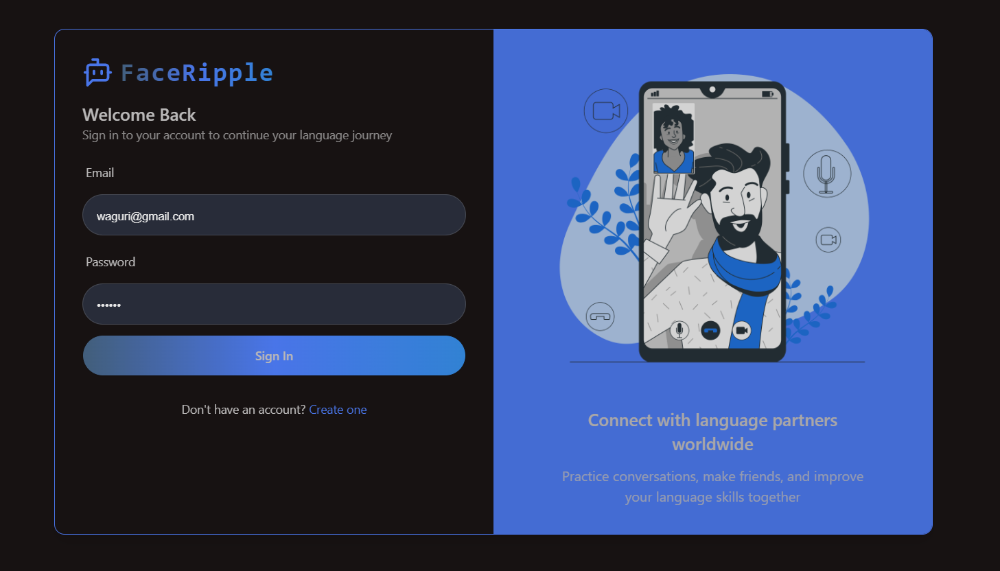
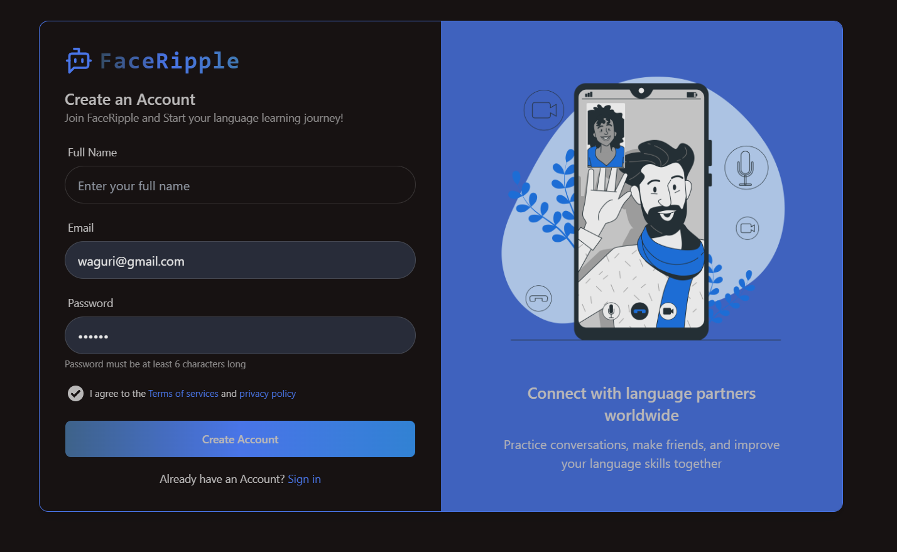
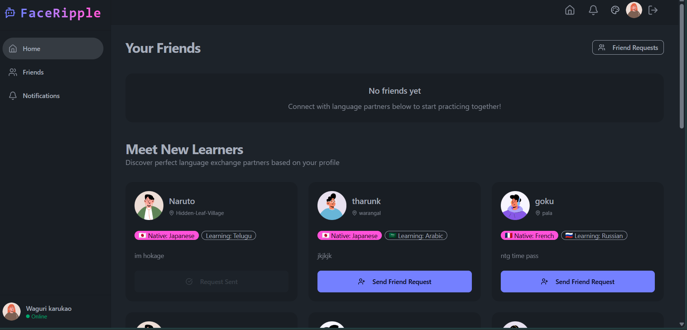
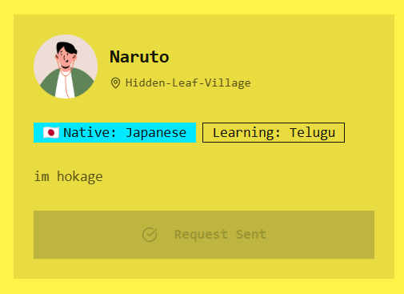
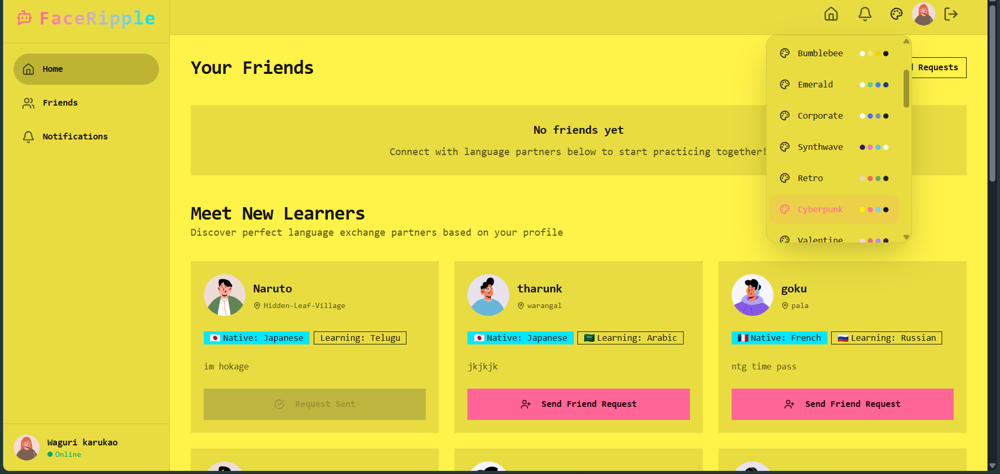

# 🌐 FaceRipple — Learn, Chat, and Grow Together!


**FaceRipple** is a real-time chat and video call application that brings friends together to **learn new languages** interactively. Built with the MERN stack, it features secure authentication, friend requests, dark/light themes, and seamless communication using GetStream API.

---

## 🖼️ UI

### 🔐 Login Page


---

### ✍️ Sign-Up Page


---

### 🏠 Home Page with Friends List


---

### 🧑‍🤝‍🧑 Send Friend Request


---

### 🌗 Theme's Toggle


---

## 🚀 Getting Started

### ⚙️ Installation Steps

```bash
# 1. Clone the repository
git clone https://github.com/your-username/languageconnect.git
cd languageconnect

# 2. Install frontend dependencies
cd frontend
npm install

# 3. Install backend dependencies
cd ../backend
npm install

# 4. Run backend server
npm run dev
````

🟢 Navigate to `http://localhost:3000` — You’ll see the **Login Page**!

---

## 🧰 Tech Stack

| Layer         | Technology                     |
| ------------- | ------------------------------ |
| Frontend      | React.js, Tailwind CSS         |
| Backend       | Node.js, Express.js            |
| Database      | MongoDB + Mongoose             |
| Realtime Chat | GetStream API                  |
| State Mgmt    | React Context API              |
| Testing       | Postman                        |
| Styling       | Tailwind CSS + Theme Switching |

---

## ✨ Features

* ✅ User Authentication (Register/Login)
* 🧑‍🤝‍🧑 Send/Accept Friend Requests
* 💬 Real-time Chat Integration (GetStream)
* 📞 Peer-to-Peer Video Calling
* 🌗 35+ Theme's Toggle
* ⚡ Fast and Responsive UI
* 🛠️ RESTful APIs

---

## 🔮 Future Enhancements

* 🌍 Multi-language UI
* 📅 Schedule Calls with Friends
* 🧠 AI-powered Translation Assistant
* 🔔 Real-time Notifications
* 📱 Mobile App (React Native)

---

---

## 🙋‍♂️ Author

👤 **Tharun Kunamalla**
💬 *Connecting friends through learning*
📫 [LinkedIn](https://linkedin.com/in/tharun-kunamalla-) 

---

## 📌 How to Contribute

1. Fork this repository
2. Create your branch: `git checkout -b feature-name`
3. Commit your changes: `git commit -m "Added something"`
4. Push to the branch: `git push origin feature-name`
5. Create a pull request ✅

## ⭐ Don't forget to star this repository if you liked it!
